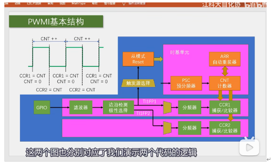
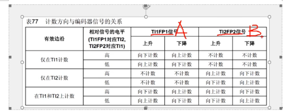
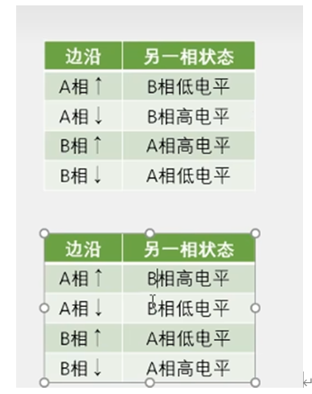
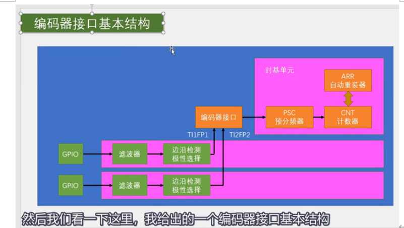

# 关于 STM32 定时器编码器接口的疑问解答

### 1. 定时器的编码器接口功能是依托于输入捕获（Input Capture）功能吗？

**是的，编码器接口部分依托于输入捕获的前端输入通道。**
- 编码器接口并不是一个完全独立的外设，它**共享了定时器通道1和通道2的输入滤波和极性选择电路**。
- 外部编码器信号（A相和B相）从 GPIO 引脚输入后，会先经过输入捕获通道的**滤波器（Filter）**和**边沿极性检测器**，最终生成信号 `TI1FP1` 和 `TI2FP2`。
- **不同点**在于：
  - 普通的**输入捕获模式**：在检测到有效边沿时，将计数器（CNT）的值锁存到捕获/比较寄存器（CCR）中。
  - **编码器接口模式**：`TI1FP1` 和 `TI2FP2` 信号直接用作计数器（CNT）的计数时钟源 and 方向控制信号，**不需要使用 CCR 寄存器进行值锁存**。

---

### 2. 编码器的信号源为 TI1FP1 和 TI2FP2，所以只能使用通道一和通道二吗？

**是的，只能使用通道1（CH1）和通道2（CH2）。**
- STM32 的定时器硬件设计中，编码器接口（Encoder Interface）的控制电路硬套在 `TI1` 和 `TI2` 通道上。
- 定时器的通道3（CH3）和通道4（CH4）没有与编码器控制逻辑相连，因此无法配置为编码器接口的输入源。这意味着每个定时器最多只能连接一个正交编码器。

---

### 3. 使用编码器接口以后，时基单元（Time Base）的配置就没用了吗？

**不是没用，时基单元的部分配置依然非常关键。**

虽然此时计数器（CNT）的加减计数是由编码器信号的边沿直接驱动的，但时基单元中的参数有不同的表现：

| 参数名称 | 是否起作用 | 作用说明 |
| :--- | :---: | :--- |
| **自动重装值 (ARR / Period)** | **起作用 (极关键)** | 决定了计数器的计数上限（量程）。当编码器计数值达到 `ARR` 时会溢出归零；往回转到 0 以下时会下溢回到 `ARR`。在测速时，通常设置为最大值 `65535` 防止计数溢出；在测绝对位置时，可设置为“一圈的脉冲数 - 1”来实现角度直接对应。同时，溢出依然可以触发更新中断。 |
| **时钟分频 (ClockDivision)** | **起作用** | 用于配置**输入通道滤波器的采样时钟**，虽然不直接影响计数速度，但会影响**硬件滤波防抖**的效果。 |
| **预分频器 (Prescaler / PSC)** | **不起作用** | 编码器接口模式下，编码器的边沿信号直接驱动 CNT 计数，绕过了预分频器。因此，这里配置的预分频值（如 `72-1`）不会对编码器计数信号进行分频。 |
| **计数方向 (CounterMode)** | **被硬件接管** | 计数的方向（向上自增 / 向下自减）是由外部编码器 A/B 相的相位关系（即超前还是滞后）动态决定的。因此，初始化时配置的 `TIM_CounterMode_Up` 会被编码器接口模式自动覆盖。 |
| **重复计数器 (RepetitionCounter)**| **无影响** | 仅高级定时器拥有，在普通编码器应用中一般设为 0。 |

---

### 4. 编码器接口与 PWMI（PWM 输入捕获）功能的区别是什么？




依据硬件逻辑结构图，我们可以从以下几个核心维度进行对比分析：

#### 1) 输入引脚与信号来源
* **编码器接口（图一）**：
  * 需要使用**两个** GPIO 引脚，分别接收编码器的 **A 相****和** B 相正交信号。
  * 信号源对应两个独立的输入通道，即引脚输入经过滤波器和极性选择后，生成独立的 `TI1FP1` 和 `TI2FP2` 信号，共同输入到编码器接口模块。
* **PWMI（图二）**：
  * 只需要使用**一个** GPIO 引脚，接收一路外部的 PWM 信号。
  * 该信号在输入通道 1 后通过内部的**交叉通道**设计，分叉生成两个**极性相反**的内部信号 `TI1FP1` 和 `TI1FP2`。

#### 2) 计数器 CNT 的驱动源与计数行为
* **编码器接口**：
  * 计数器 `CNT` 的**时钟源**被切换为**外部编码器信号**的边沿。
  * **CNT 的加减计数完全由编码器接口硬件根据 A/B 相的相位关系动态驱动**。正转时 CNT 递增，反转时 CNT 递减，计数速率与编码器旋转速度同步。
* **PWMI**：
  * 计数器 `CNT` 依然使用**内部时钟源**（通过配置的 PSC 预分频器进行恒定的自增计数）。
  * 外部 PWM 信号并不直接驱动 CNT 计数，而是作为**触发源**，在特定的边沿（如上升沿）通过“触发源选择”和“从模式 Reset”将 CNT **自动复位清零**。

#### 3) 核心寄存器的参与及捕获功能
* **编码器接口**：
  * **不使用捕获寄存器（CCR1 和 CCR2）**。我们直接通过读取 `CNT` 的实时数值来获取位置（角度）或速度。
* **PWMI**：
  * **必须使用捕获寄存器（CCR1 和 CCR2）**。
  * `CCR1`：在 PWM 周期结束时（如上升沿）捕获 `CNT` 的值，代表 **PWM 信号的周期**（此时 CNT 被复位清零）。
  * `CCR2`：在电平翻转时（如下降沿）捕获 `CNT` 的值，代表 **PWM 信号的高电平时间（用于计算占空比）**。

#### 4) 总结对比表

| 对比维度 | 编码器接口 (Encoder Interface) | PWMI (PWM 输入) |
| :--- | :--- | :--- |
| **物理引脚数** | 2 个 (通常为 CH1 和 CH2) | 1 个 (通常为 CH1 或 CH2) |
| **内部信号** | `TI1FP1` + `TI2FP2` | `TI1FP1` + `TI1FP2` (单通道分弯交叉) |
| **CNT 时钟驱动** | 外部编码器脉冲边缘直接驱动 | 定时器内部时钟驱动 (如 72MHz) |
| **CNT 计数方向** | 由 A/B 相相位决定 (可增可减) | 固定自增 (靠外部信号边沿触发复位清零) |
| **核心寄存器** | 仅使用 `CNT` 寄存器 | 使用 `CCR1` (周期) 和 `CCR2` (占空比) |
| **典型应用场景** | 旋转编码器测角速度、方向和位置 | 测量外部 PWM 信号的频率和占空比 |

---

### 5. 依据“计数方向与编码器信号的关系”表，分析编码器接口的工作模式





根据 STM32 手册中的表格（表77），编码器接口一共有**三种工作模式**。其核心逻辑是：**“在一路信号的边沿（上升沿/下降沿）触发计数，并根据另一路信号的电平高低来决定是正向计数（向上）还是反向计数（向下）”**。

这三种模式分别对应库函数中的三种配置选项：

#### 1) 仅在 TI1 计数（TIM_EncoderMode_TI1）
* **工作机制**：计数器只在通道 1（A相，`TI1`）的信号边沿进行计数，通道 2（B相，`TI2`）的信号只作为方向判断的电平参考。
* **规则解析**：
  * 当 **`TI2`（B相）为高电平**时：`TI1` 发生**上升沿**，计数器**向下计数**（减）；发生**下降沿**，计数器**向上计数**（加）。
  * 当 **`TI2`（B相）为低电平**时：`TI1` 发生**上升沿**，计数器**向上计数**（加）；发生**下降沿**，计数器**向下计数**（减）。
  * 当 **`TI2` 自身翻转**时：计数器**不计数**。
* **分辨率**：属于 **2 倍频模式**（在一周期的 A 相信号中，上升沿和下降沿各计数一次，共 2 次）。

#### 2) 仅在 TI2 计数（TIM_EncoderMode_TI2）
* **工作机制**：与模式 1 相反。计数器只在通道 2（B相，`TI2`）的信号边沿进行计数，通道 1（A相，`TI1`）作为方向判断的电平参考。
* **规则解析**：
  * 当 **`TI1`（A相）为高电平**时：`TI2` 发生**上升沿**，计数器**向上计数**（加）；发生**下降沿**，计数器**向下计数**（减）。
  * 当 **`TI1`（A相）为低电平**时：`TI2` 发生**上升沿**，计数器**向下计数**（减）；发生**下降沿**，计数器**向上计数**（加）。
  * 当 **`TI1` 自身翻转**时：计数器**不计数**。
* **分辨率**：属于 **2 倍频模式**（只对 B 相的两个边沿进行计数）。

#### 3) 在 TI1 和 TI2 上计数（TIM_EncoderMode_TI12）
* **工作机制**：计数器在通道 1（A相）和通道 2（B相）的**所有信号边沿（上升沿和下降沿）都进行计数**，两路信号互为电平参考。这是**最常用、精度最高**的模式。
* **规则解析**：
  * 当 `TI1` 发生边沿变化时，依据 `TI2` 的电平高低进行加/减计数（规则同模式 1）。
  * 当 `TI2` 发生边沿变化时，依据 `TI1` 的电平高低进行加/减计数（规则同模式 2）。
* **分辨率**：属于 **4 倍频模式**（在一个正交周期内，A 相上升沿、下降沿以及 B 相上升沿、下降沿都会触发计数，共计 4 次）。这能将编码器的物理分辨率提升 4 倍，同时由于对双通道所有边沿都进行了校验，防抖动和抗干扰能力最强。

#### 4) 为什么“高电平上升沿”和“低电平上升沿”的计数方向相反？
这是由于正交编码器的**相位差**决定的。
* **正转时**：A 相超前 B 相 $90^\circ$。在 A 相的上升沿瞬间，B 相永远处于低电平。
* **反转时**：B 相超前 A 相 $90^\circ$。在 A 相的上升沿瞬间，B 相已经先变为了高电平。
因此，硬件通过“在 A 相上升沿时，检测 B 相是高电平还是低电平”就能瞬间得知电机是在正转还是反转，从而决定 CNT 是加还是减。

---

### 6. 为什么配置好定时器编码器模式后，只需读取 TIM_GetCounter 即可？CNT 的加减是硬件自动执行的吗？

**是的，CNT 计数器的加（递增）和减（递减）完全是由 STM32 内部的硬件电路自动完成的，不需要编写任何软件代码去控制它。**

这是 STM32 等单片机中**“硬件外设分担 CPU 工作”**的典型设计思想。

#### 1) 为什么不需要软件控制？
如果我们用软件来测速，逻辑会是这样的：
1. 外部引脚产生中断（例如 A 相上升沿）。
2. CPU 暂停手头的工作，进入中断服务函数。
3. 软件去读取 B 相引脚的电平状态。
4. 如果是高电平就让变量加 1，低电平就减 1。
* **缺点**：当电机高速旋转时，脉冲频率极高（可能达到几万赫兹）。如果每次脉冲都要 CPU 进中断处理，CPU 将会被活活卡死在中断里，且由于软件执行速度有限，极易造成**漏计、丢步**。

#### 2) 硬件是如何自动执行的？
当我们在初始化中调用 `TIM_EncoderInterfaceConfig` 配置好编码器接口后：
* 定时器内部的硬件逻辑门电路（触发源选择器、方向选择器等）会**在物理电路上直接连通**输入引脚与 CNT 计数器。
* 每当引脚上出现编码器脉冲的有效边沿时，硬件电路就会自动产生一个微小的电信号，作为 CNT 计数器的**输入时钟**，直接驱动计数器寄存器。
* 同时，硬件测向电路会根据两路正交信号的相位关系，自动输出高/低电平给 CNT 的**方向控制引脚**（决定是向上自增还是向下自减）。
* **结果**：无论电机转得多快，所有的边沿检测、方向判断、加减计数都由专用的**定时器硬件电路**在纳秒级时间内完成，不占用任何 CPU 算力。

#### 3) 软件需要做什么？
软件唯一需要做的事情，就是在我们需要知道当前位置或速度的时候，充当“收割者”：
* **测位置**：直接调用 `TIM_GetCounter(TIM3)` 读取当前的 CNT 值，这就代表了电机的绝对位置。
* **测速度**：利用另一个定时器（如 TIM2）进行 1 秒定时。时间到时，在中断里调用 `TIM_GetCounter(TIM3)` 读取 CNT 值，然后立刻调用 `TIM_SetCounter(TIM3, 0)` 将 CNT 寄存器清零，为下一次测速做准备。

---

### 7. 为什么 CNT 的值可以代表旋转速度？

这属于控制领域中经典的**“测频法”**测速原理。简单来说：**速度 = 路程 ÷ 时间**，在旋转运动中，**转速 = 转过的圈数 ÷ 时间**。

我们来一步步拆解为什么 CNT 的值能直接反映转速：

#### 1) 脉冲数与物理转角的对应关系
每个编码器都有固定的物理规格（例如“每转输出 20 个脉冲”，简称 20 PPR）。
* 旋转一整圈（$360^\circ$）产生的脉冲数是固定的。
* 如果我们使用**4倍频模式**（在 A/B 相的上升沿和下降沿都计数），编码器旋转一圈，CNT 计数器就会自增或自减：
  $$\text{一圈的总计数值 (N)} = 20 \times 4 = 80 \text{ 个数}$$
* 因此，**计数值的变化量（CNT 的变化）直接代表了电机转过的角度（路程）**。

#### 2) 时间的引入（闸门时间）
速度必须在一段时间内测量才有意义。我们设置 TIM2 每隔固定时间（例如 $\Delta t = 1\text{ 秒}$）产生一次中断去读取并清零 CNT：
* 假设在这 1 秒内，我们读取到 CNT 增加的值为 $C$：
  $$\text{速度 (脉冲数/秒)} = \frac{C}{\Delta t} = \frac{C}{1} = C$$
* 因为时间 $\Delta t = 1$ 是常数，所以**这 1 秒内采集到的脉冲数 $C$（即 CNT 的当前值）在数值上直接等于每秒脉冲数（PPS）**。

#### 3) 换算为物理转速（RPM，每分钟转数）
如果你需要把 CNT 的值换算成我们日常理解的“每分钟转多少圈（RPM）”，可以使用以下公式：
$$\text{转速 (RPM)} = \frac{\text{1秒内计数值 } C}{\text{一圈的总计数值 } N} \times 60 \text{ 秒}$$
* 举个例子：如果在 1 秒内我们读到 CNT 值为 $C = 160$（一圈总计数值 $N = 80$）：
  $$\text{转速} = \frac{160}{80} \times 60 = 120 \text{ RPM (每分钟转 120 圈)}$$
* 在上述公式中，分母 $N$ 和常数 $60$ 都是固定不变的。所以，**转速与 CNT 的值 $C$ 呈绝对的正比例关系**。CNT 值越大，代表电机转得越快；CNT 值为负数，代表电机在反转。

---

### 8. 这个得到速度的算法是硬件里面编写的吗？

**不是的。硬件只负责最底层的“计数”工作，而测速的“算法逻辑”（即定时读取、清零、换算）必须由我们在软件（C代码）中编写。**

我们可以把整个过程划分为**“硬件只管计数”**和**“软件实现算法”**两部分：

#### 1) 硬件只做了什么？（无脑计数）
STM32 内部的定时器硬件**非常单纯**，它完全不知道什么是“时间”，更不知道什么是“速度”或“每分钟转数（RPM）”。
* 硬件唯一的职责就是：只要编码器转动，它就**实时、自动地给 CNT 寄存器做加法或减法**。
* 如果你不用软件去干预它，CNT 就会一直无限累加或累减（在 0 到 65535 之间循环）。

#### 2) 软件做了什么？（实现测速算法）
所谓的“测速算法”（测频法），其**时序逻辑和数学公式全部是由我们在 C 代码中编写并执行的**：

* **定时触发（软件控制时间）**：
  我们通过软件配置了定时器 TIM2，让它每隔 1 秒进一次中断。这个“1秒的闸门时间”是软件定时器提供的。
* **读取与清零（软件控制逻辑）**：
  在 TIM2 中断服务函数中，我们编写了读取和清零的代码：
  ```c
  int16_t Encoder_Get(void)
  {
      int16_t Temp = TIM_GetCounter(TIM3); // 软件读取当前的计数值
      TIM_SetCounter(TIM3, 0);             // 软件手动清零 CNT，为下一秒做准备
      return Temp;
  }
  ```
  如果没有软件手动调用 `TIM_SetCounter(TIM3, 0)` 将其清零，计数器就会继续累加，你就无法通过“单次读取值”直接得到“单位时间内的脉冲数（速度）”了。
* **物理量换算（软件计算公式）**：
  如果需要将 CNT 的值换算为转速（RPM）或实际速度（m/s），我们需要在代码中写出计算公式。例如：
  ```c
  float Real_Speed = (float)Speed / 80.0f * 60.0f; // 软件执行乘除法计算
  ```
  硬件本身是绝对不会帮你做这种乘除法换算的。

---

### 9. 为什么我的项目中只是每秒读取一次 CNT 的值，然后就将其当作速度了？

**这其实就是一种最简单、最直接的测速算法！** 

你之所以能直接把读取到的 CNT 值当作“速度”，是因为满足了两个隐藏的条件：

#### 1) 它的物理单位是“每个闸门时间内的脉冲数”
“速度”是由数值和单位组成的。在你直接把 CNT 的值当作速度时，它的单位实际上是 **“个/秒（脉冲数每秒，即 PPS）”**：
* 速度的通用定义为：$\text{速度} = \frac{\text{改变量}}{\text{时间间隔}}$。
* 因为你的时间间隔（闸门时间）刚好是 **1 秒**，所以在公式里：
  $$\text{速度} = \frac{\text{CNT改变量 } C}{1 \text{ 秒}} = C \text{ (脉冲数/秒)}$$
* 在数值上，脉冲改变量 $C$ 恰好等于速度值。这是一种巧妙的简化。如果我们把定时时间改为 **0.1 秒**，你就不能直接拿 CNT 值当速度了，必须把 CNT 值乘以 10 才是每秒的脉冲数。

#### 2) 你在代码中执行了“清零”操作（关键）
请看你的 [Encoder.c](file:///D:/Project/STM32/Jiangxie%20TechnologySTM32/STM32_Standard_Peripheral_Library/6-8%20%E5%AE%9A%E6%97%B6%E5%99%A8%E7%BC%96%E7%A0%81%E5%99%A8%E6%8E%A5%E5%8F%A3%E6%B5%8B%E9%80%9F(%E6%97%8B%E8%BD%AC%E7%BC%96%E7%A0%81%E5%99%A8)/Hardware/Encoder.c) 中的 `Encoder_Get()` 函数：
```c
int16_t Encoder_Get(void)
{
	int16_t Temp = 0;
	Temp = TIM_GetCounter(TIM3); // 1. 读取当前 CNT 值
	TIM_SetCounter(TIM3, 0);     // 2. 将 CNT 寄存器清零！
	return Temp;
}
```
* 因为有第 2 步的 `TIM_SetCounter(TIM3, 0)`，每次你读取完 CNT，它都会被**复位为 0**。
* 这样，下一次读取到的 CNT 就不再是“自古以来的累积旋转位置”，而**刚好是这新产生的 1 秒内的变化量**。
* 如果你把第二步的清零代码删掉，那么读取到的 CNT 就会是 $100 \rightarrow 200 \rightarrow 300 \rightarrow 400$，代表电机一直往前转（这叫**位置**）；只有清零了，读取到的值才会是 $100 \rightarrow 100 \rightarrow 100 \rightarrow 100$，代表每秒转 100 个脉冲（这叫**速度**）。

#### 3) 总结
直接拿 CNT 当速度，在控制和显示上是完全没问题的（例如，显示“Speed: 120”代表每秒 120 个脉冲）。只是它没有转换成我们日常用的“圈/分钟（RPM）”或者“米/秒（m/s）”等物理单位。如果你需要显示真实的 RPM，只需要在软件中对这个值做一次比例换算即可。

---

### 10. TIM3 的 PSC 设为 0 是因为没用吗？ARR 的值代表速度上限吗？



这两个问题切中了定时器时基单元在编码器模式下的底层物理机制。

#### 1) 预分频系数 PSC 设为 0 (实际为 1 分频)，是因为没用吗？

**是的，确实没用。**

* 在普通的定时中断或 PWM 输出模式下，计数器 CNT 的时钟来自系统内部时钟（经过 PSC 分频）。
* 但在**编码器接口模式**下，计数器 CNT 的驱动时钟直接由外部引脚输入的正交脉冲边沿（`TI1FP1` 和 `TI2FP2`）提供。
* 内部硬件电路在此模式下会**直接绕过预分频器（PSC）**。也就是说，无论你把 PSC 配置为 0、10 还是 7200-1，外部脉冲输入到 CNT 的分频比永远都是 1:1，PSC 的设置完全不会起作用。将其设为 0（不分频）只是作为一个默认占位符。

#### 2) ARR 的值代表速度上限吗？

**ARR（自动重装值）并不直接代表“电机的速度上限”，但它确实决定了“单次测量的最大可测速度范围（即测速上限）”。**

我们从以下几个维度来理解 ARR 的作用：

* **ARR 的真实含义（计数器的容器大小）**：
  在你的项目中，ARR 被配置为最大的 `65535`（即 `65536 - 1`）。这代表 CNT 计数器的容量范围是 $0 \sim 65535$。
  
* **为什么说它决定了“测速上限”？**
  因为我们是每隔 1 秒读取一次 CNT 并清零。如果在这一秒内，电机转得飞快，产生的脉冲数超过了 CNT 计数器的量程，就会发生**溢出（Wrap-around）**。
  * 你的速度变量是 **有符号的 16 位整数 (`int16_t`)**，其数值范围是 $-32768 \sim +32767$。
  * **极限情况**：如果在一秒内，电机产生的计数值达到了 `32768`，那么在转换为 `int16_t` 时就会发生溢出，数值会突变为 `-32768`（即系统会误认为电机在以极快的速度反转）。
  * 因此，配合 `int16_t`，在 1 秒的闸门时间下，你的**最大不溢出测速上限**是：**每秒 32767 个计数**。
  
* **如果把 ARR 设小了会怎么样？**
  如果你故意把 ARR 设得很小（比如设为 `100`），那么在 1 秒内，只要编码器计数值超过 100，计数器就会自动清零重新算。此时你读取到的 CNT 就不再是真实的脉冲数（例如产生 150 个脉冲，由于 ARR 是 100，CNT 溢出后最终只剩下 50），导致测速严重失真。
  
* **总结**：
  * ARR **不决定**电机能转多快（硬件引脚的最大输入频率通常可达几十兆赫兹，远超普通电机的输出极限）。
  * 但 ARR 的大小决定了**计数器在不溢出的情况下，一个闸门时间内能容纳的最大脉冲数**。为了防止高速测量时溢出导致速度读数错误，我们必须把 ARR 设为最大值（即 `65535`）。


